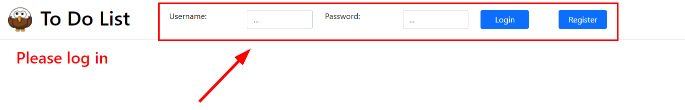
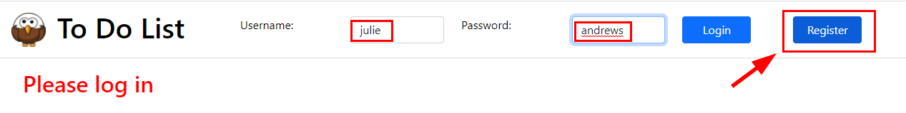
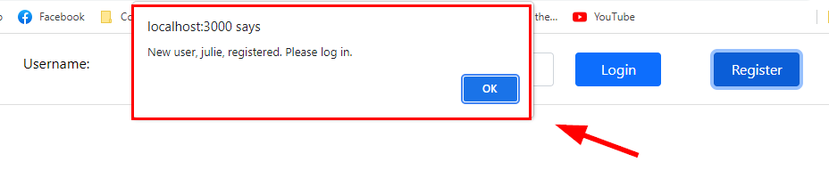
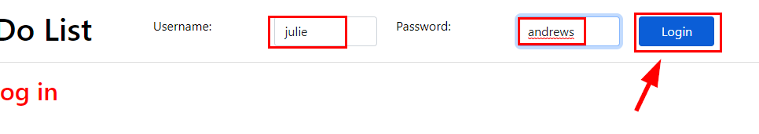
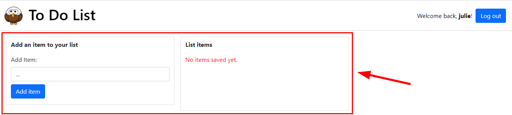
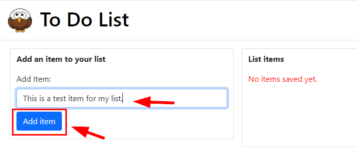
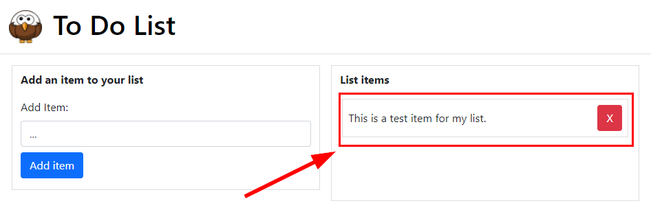
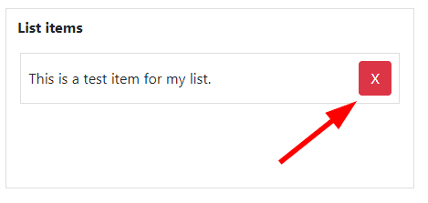
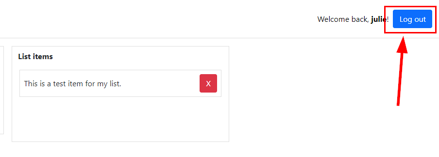

# HyperionDev Full Stack Web Development Bootcamp - Level 3 - Task 9 - To Do List 2

## Description

This task involved taking a simple "To Do list" project from earlier in the course and modifying it to save the user's to do list to a MongoDB database so that it persists from session to session and also to add user authentication with JWT (JSON Web Tokens). A user can log in, add items to their to do list and delete items as well.

This app has been deployed with [Heroku](https://www.heroku.com/platform) to: [https://evanstodolist.herokuapp.com/](https://evanstodolist.herokuapp.com/).

## Table of Contents

- [Instructions](#instructions)
- [Technologies](#technologies)
- [Installation](#installation)
- [Usage](#usage)
- [Credits](#credits)

## Instructions

These were the instructions I was given to guide me in this task:

**Follow these steps:**

- You have previously created a simple to-do app using React where a user could add a number of items that get displayed as a to-do list. The user could also delete a specific item from the list.

- Modify this task so that a user is required to log in to your application before they can use it by entering a username and password for your app directly.

- Each users’ to-do list should be saved to a database. When a user logs in they should only be able to see and modify their own to-do list. The user’s to-do list should be preserved between sessions.

- Please remember to use JWT as demonstrated in this task.

### Technologies

This project uses:

- HTML
- CSS
- Javascript ECMAScript 2021
- React
- Node
- Express
- MongoDB
- JWT (JSON Web Tokens)

## Installation

To run this project, do the following:

1. Copy the project files to a directory called 'todolist' on your local machine.
2. Navigate to this directory from the command line interface. E.g. cd c:/todolist.
3. In the command line interface type 'npm install'.
4. Once it has finished installing, type 'npm start'.
5. Now navigate to the "/frontend" directory inside "todolist". E.g. cd c:/todolist/frontend.
6. In the command line interface, once again type 'npm install'.
7. Once it has finished installing, type 'npm start'.
8. You have now started both the backend and frontend servers.
9. Open [http://localhost:3000](http://localhost:3000) to view the project in your web browser.

## Usage

1. Once you open the project in your browser [http://localhost:3000](http://localhost:3000), you will see the login form at the top of the screen. See figure 1 below.

Figure 1

### Register

2. In order to start using the app, you need to register as a user first. Type in the username and password that you want to use and then click the "Register" button. You will receive a pop up message that says you have been registered and asks you to log in. See figure 2 and 3 below.

Figure 2

Figure 3

### Log in

3. To log in, type in your username and password (the ones you used to register as a user in the previous step), and click on the "Login" button. See figure 4 below.

Figure 4

4. You will now be able to add list items. See figure 5 below.

Figure 5

### Add List Items

5. To add an item to your list, simply type it into the box and click the "Add item" button. You will see your item displayed on the right. See figure 6 and 7 below.

Figure 6

Figure 7

### Delete List Item

5. To delete an item from your list, just click the red cross button next to the item. See figure 8 below.

Figure 8

### Logging Out

6. To log out of the list app, just click the "Logout" button at the top right of the screen. The items that you added to your list will be safely stored and you will be able to view them again the next time you log into the app. See figure 9 below.

Figure 9

## Credits

This project was created by Evan Malherbe as part of a task for HyperionDev Full Stack Development Bootcamp - December 2021 [GitHub profile](https://github.com/evanmalherbe)
